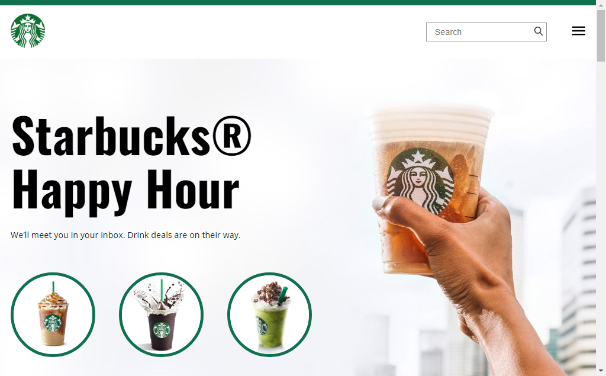

# Starbucks

> Projeto Starbucks

Projeto Starbucks foi criado durante o curso da B7Web para melhorar meus conhecimentos em HTML e CSS.

[Clique para acessar](https://guimiiller.github.io/starbucks/)

## 🚀 Tecnologias

- HTML
- CSS
- Git e Github

## 💻 O que aprendi

- Aprendi a usar o grid para criar a estrutura do site
- Melhorei minhas habilidades em relação a responsividade de sites

## 📨 Contato

- guilhermemillerblack@gmail.com